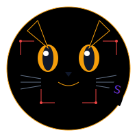

<div align="center">
<h1 style="font-size: 2.5em;">SOLCAT</h1>
</div>

<div align="center">
  
  
  [](https://www.solcat.work)
  [](https://x.com/SOLCAT_xyz)
</div>

## 🔑 Overview

SOLCAT is a decentralized threat intelligence and risk assessment platform built on the Solana blockchain. Our platform enables the community to collaboratively identify, report, and protect against malicious activities in the Solana ecosystem through a comprehensive risk scoring mechanism and reward system.

### Key Features

- **Risk Assessment**: Advanced risk scoring system for Solana addresses
- **Community Reporting**: Decentralized threat reporting mechanism
- **Anti-Sybil System**: Robust protection against false reports
- **Reward Mechanism**: Token-based incentives for accurate reporting
- **Analytics Dashboard**: Real-time threat intelligence visualization
- **Browser Extension**: Instant risk checking while browsing

## 🏗️ System Architecture

SOLCAT employs a modern, scalable architecture designed for security and real-time threat detection.

### High-Level Architecture

```
┌─────────────────────────────────────────────────────────────────────┐
│                        Client Applications                          │
│                                                                     │
│   ┌─────────────────┐   ┌─────────────────┐   ┌─────────────────┐   │
│   │   Web Interface │   │Browser Extension│   │Analytics Portal │   │
│   │   (React/Next)  │   │   (Chrome/FF)   │   │   (Tremor)     │   │
│   └─────────────────┘   └─────────────────┘   └─────────────────┘   │
└────────────────────────────────┬────────────────────────────────────┘
                                 │
                                 ▼
┌─────────────────────────────────────────────────────────────────────┐
│                        Backend Services                             │
│                                                                     │
│ ┌─────────────┐ ┌─────────────┐ ┌─────────────┐ ┌─────────────┐    │
│ │ Risk        │ │ Report      │ │ Reward      │ │ Analytics   │    │
│ │ Service     │ │ Service     │ │ Service     │ │ Service     │    │
│ └─────────────┘ └─────────────┘ └─────────────┘ └─────────────┘    │
└────────────────────────────────┬────────────────────────────────────┘
                                 │
                                 ▼
┌─────────────────────────────────────────────────────────────────────┐
│                       Blockchain Layer                              │
│                                                                     │
│   ┌─────────────────┐   ┌─────────────────┐   ┌─────────────────┐   │
│   │ Risk Assessment │   │ Reward          │   │ Governance      │   │
│   │ Contract        │   │ Distribution    │   │ System         │   │
│   └─────────────────┘   └─────────────────┘   └─────────────────┘   │
└─────────────────────────────────────────────────────────────────────┘
```

## 💻 Technical Stack

SOLCAT is built with a modern technology stack:

### Frontend
- **Framework**: React with Next.js for server-side rendering
- **UI Components**: Tremor for analytics dashboard
- **Wallet Integration**: Solana wallet adapters (@solana/wallet-adapter)
- **Browser Extension**: Chrome/Firefox extension with TypeScript

### Backend
- **API**: RESTful API with Express.js
- **Database**: PostgreSQL for off-chain data
- **Caching**: Redis for performance optimization
- **Analytics**: Real-time data processing pipeline

### Blockchain Infrastructure
- **Network**: Solana (mainnet and devnet)
- **Smart Contracts**: Rust using Anchor framework
- **Token Standard**: SPL Token for reward distribution

## 🚀 Getting Started

### Prerequisites
- Node.js (v16+)
- Rust and Cargo
- Solana CLI tools
- Anchor framework

### Installation

```bash
# Clone the repository
git clone https://github.com/solcat/SOLCAT.git
cd SOLCAT

# Install dependencies
npm install

# Set up environment variables
cp .env.example .env
# Edit .env file with your configuration

# Build smart contracts
cd programs/solcat-program
cargo build

# Start development server
npm run dev
```

## 📊 Core Features

### Risk Assessment System

SOLCAT implements a comprehensive risk scoring mechanism:

1. **Risk Types**
   - Scam detection
   - Phishing identification
   - Malware tracking
   - Money laundering detection
   - Market manipulation monitoring

2. **Scoring Factors**
   - Transaction patterns
   - Account age and history
   - Interaction frequency
   - Community reports
   - Verification status

3. **Anti-Sybil Mechanisms**
   - Stake requirements
   - Reputation system
   - Time-lock periods
   - Report limits

### Reward System

The platform incentivizes accurate reporting through:

- **Token Rewards**: Distribution based on report accuracy
- **Reputation Points**: Earned through verified reports
- **Staking Benefits**: Enhanced rewards for stakers
- **Governance Rights**: Voting power based on contribution

## 🔒 Security Features

1. **Smart Contract Security**
   - Formal verification
   - Multiple audits
   - Secure staking mechanism
   - Time-locked operations

2. **Report Validation**
   - Multi-stage verification
   - Stake-weighted consensus
   - Historical analysis
   - Pattern recognition

3. **System Security**
   - Rate limiting
   - Access control
   - Secure API endpoints
   - Data encryption

## 📖 Documentation

- [User Guide](docs/user_guide.md) - Platform usage guide
- [Developer Docs](docs/development.md) - Integration documentation
- [API Reference](docs/api_reference.md) - API documentation
- [Smart Contracts](docs/smart_contracts.md) - Contract documentation

## 🤝 Contributing

We welcome contributions! Please read our [Contributing Guidelines](CONTRIBUTING.md) for details on our code of conduct and the process for submitting pull requests.

### Development Workflow

1. Fork the repository
2. Create a feature branch (`git checkout -b feature/amazing-feature`)
3. Commit your changes (`git commit -m 'Add some amazing feature'`)
4. Push to the branch (`git push origin feature/amazing-feature`)
5. Open a Pull Request

## 📜 License

This project is licensed under the MIT License - see the [LICENSE](LICENSE) file for details.

## 📞 Contact

- Website: [solcat.work](https://solcat.work)
- Twitter: [@SOLCAT_xyz](https://x.com/SOLCAT_xyz)

Built with ❤️ by the SOLCAT Team 